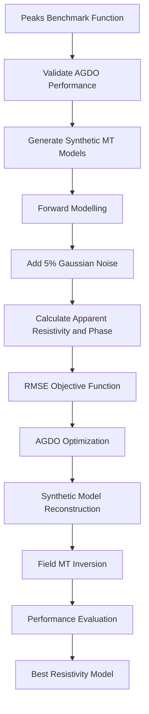
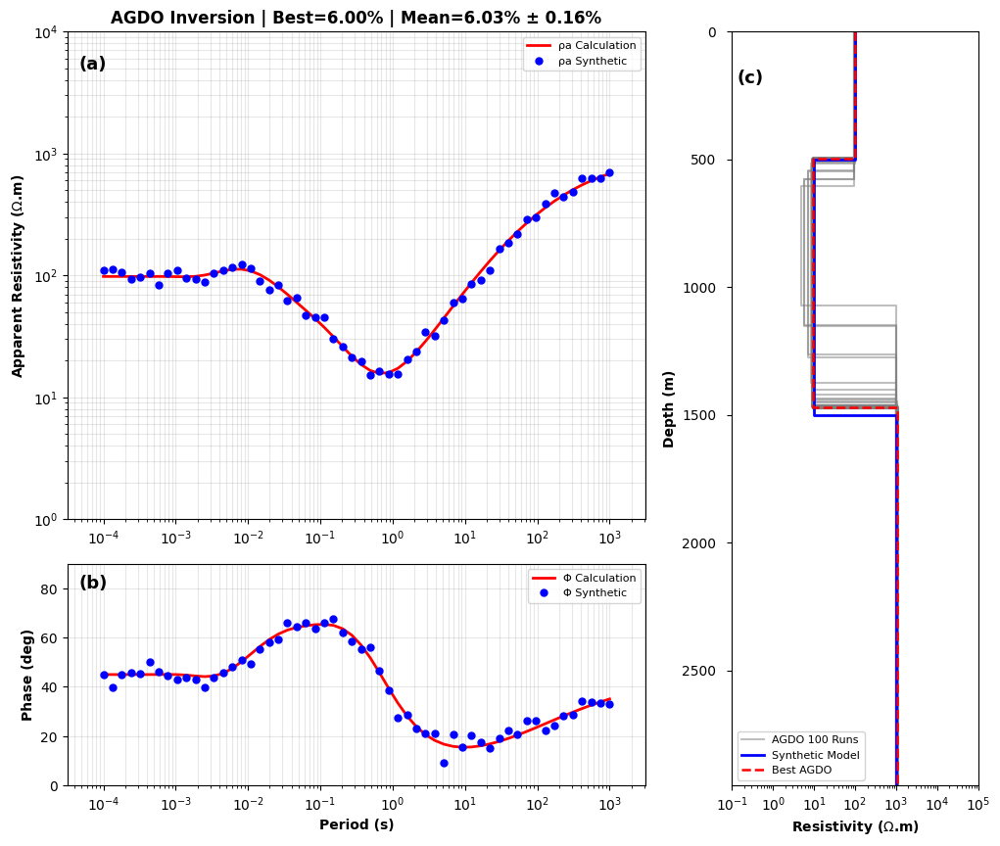
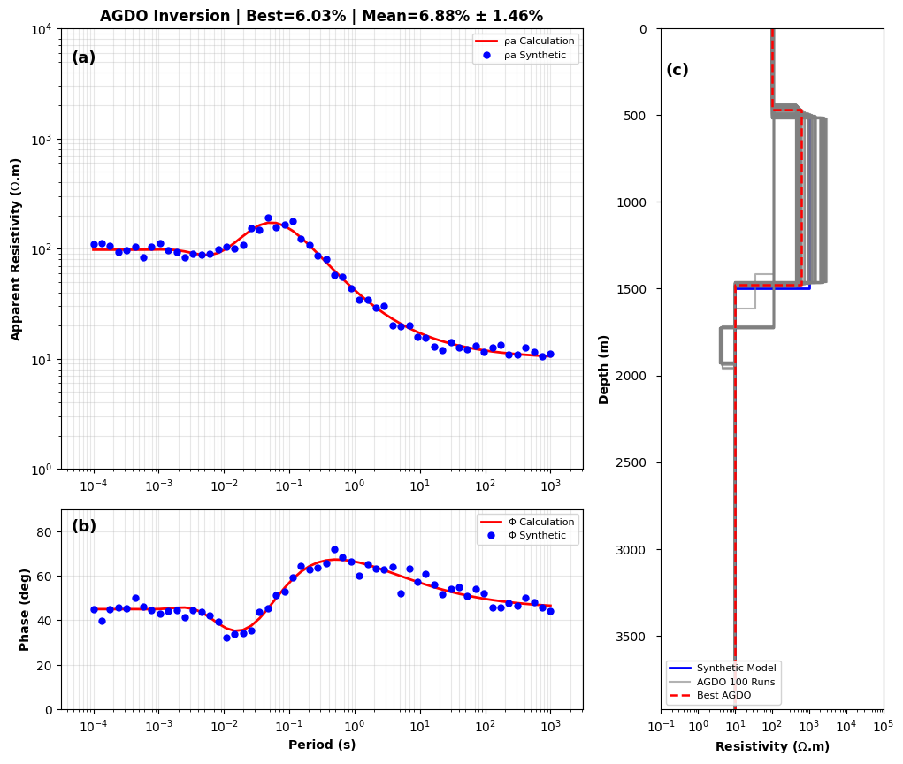
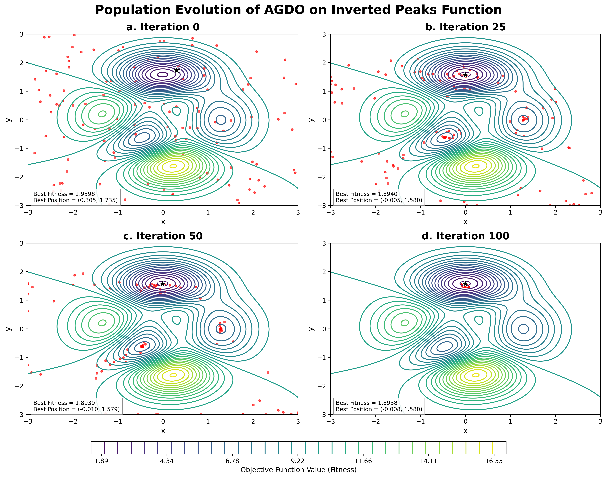
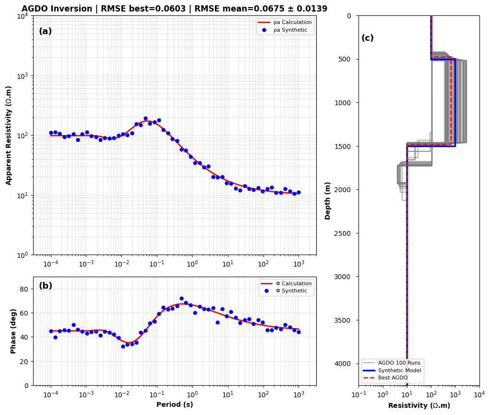
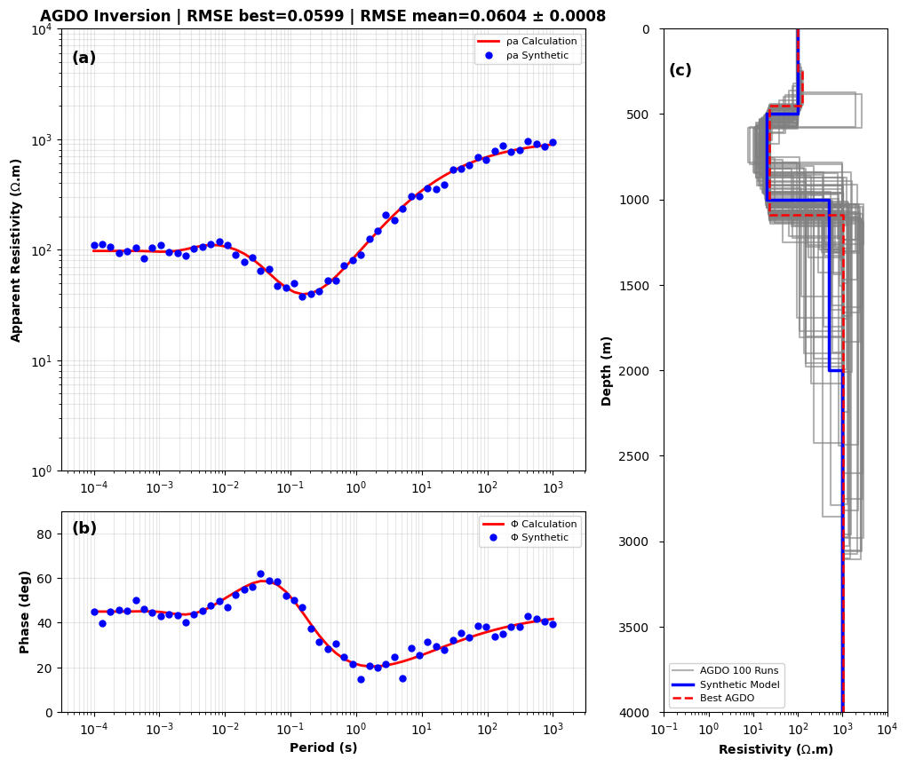
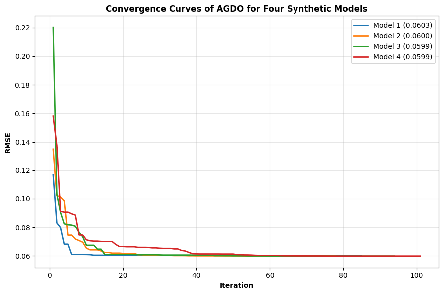
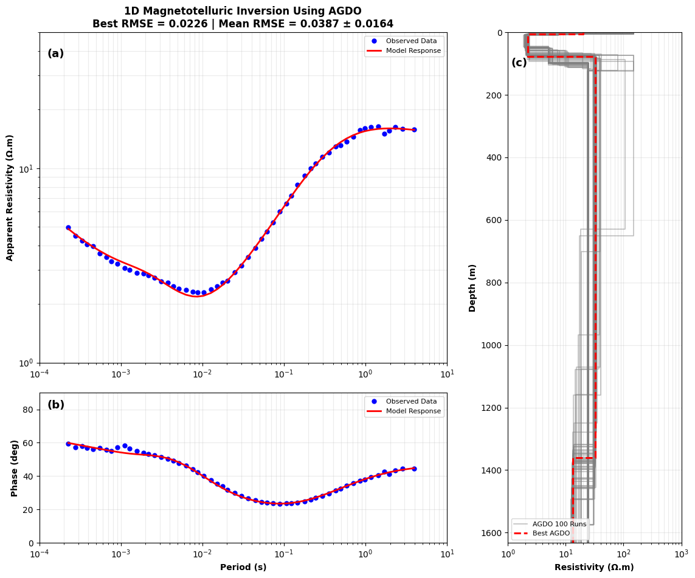
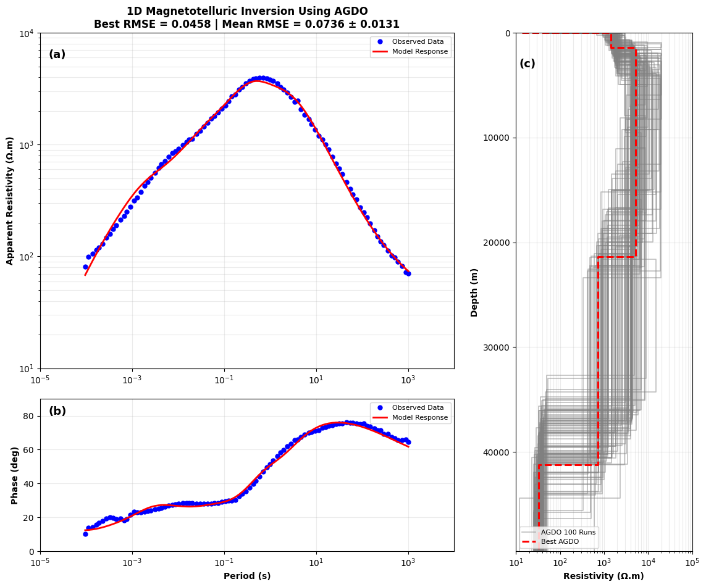

# AGDO for One-Dimensional Magnetotelluric (MT) Inversion

<p align="center">


</p>

<p align="center">

Implementation of the <b>Adam Gradient Descent Optimizer (AGDO)</b> for solving the <b>One-Dimensional Magnetotelluric (MT) Inversion</b> problem using synthetic and field datasets.

</p>

---

# Overview

This repository contains the complete implementation of the **Adam Gradient Descent Optimizer (AGDO)** for solving the **One-Dimensional Magnetotelluric (MT) Inversion** problem.

The project was developed as part of a research study investigating the performance of AGDO in estimating subsurface electrical resistivity models from magnetotelluric observations.

Unlike conventional deterministic inversion methods, AGDO combines adaptive gradient optimization with a population-based search strategy, enabling better exploration of the model space while maintaining stable convergence during optimization.

The implementation has been evaluated using

- Peaks benchmark function
- Synthetic layered-earth models
- Real magnetotelluric field data

The notebook contains the complete workflow, including

- Forward modelling
- Synthetic data generation
- Objective function evaluation
- AGDO optimization
- Visualization
- Field inversion
- Convergence analysis

---

# Research Highlights

✔ One-Dimensional MT Forward Modelling

✔ Adam Gradient Descent Optimizer (AGDO)

✔ Synthetic MT Inversion

✔ Field MT Inversion

✔ Gaussian Noise Simulation

✔ Adaptive Learning Rate

✔ Levy Flight Exploration

✔ Early Stopping Criterion

✔ Ensemble Analysis (100 Independent Runs)

✔ Publication Implementation

---

# Repository Structure

```text
AGDO-MT-Inversion/
│
├── AGDO_MT_Inversion.ipynb
├── H-Type.png
├── K-Type.png
├── L09S10_edt.edi
└── README.md
```

## File Description

| File | Description |
|------|-------------|
| AGDO_MT_Inversion.ipynb | Main notebook containing the complete implementation of AGDO for synthetic and field MT inversion. |
| H-Type.png | Example H-type synthetic layered-earth resistivity model. |
| K-Type.png | Example K-type synthetic layered-earth resistivity model. |
| L09S10_edt.edi | Example MT field dataset in EDI format. |
| README.md | Project documentation. |

---

# Quick Start

Clone this repository

```bash
git clone https://github.com/alyasirharahap/AGDO-MT-Inversion.git
```

Move into the project directory

```bash
cd AGDO-MT-Inversion
```

Open

```text
AGDO_MT_Inversion.ipynb
```

Run every notebook cell sequentially.

---

# Requirements

Python 3.10+

Required packages

```text
numpy
scipy
matplotlib
mtpy
```

Install dependencies

```bash
pip install numpy scipy matplotlib mtpy
```

---

# Notebook Pipeline

The notebook is organized into several sections.

```text
Import Libraries
        │
        ▼
Read MT Dataset
        │
        ▼
Forward Modelling
        │
        ▼
Generate Synthetic Data
        │
        ▼
Objective Function
        │
        ▼
AGDO Optimization
        │
        ▼
Synthetic Inversion
        │
        ▼
Field MT Inversion
        │
        ▼
Visualization
        │
        ▼
Result Analysis
```

This modular workflow makes the notebook easy to understand, reproduce, and modify for future studies.

---

# Research Workflow

The implementation follows a progressive workflow, starting from algorithm validation using a benchmark function, followed by synthetic inversion experiments, and finally field MT inversion.



The workflow ensures that the optimization algorithm is first validated under controlled conditions before being applied to real magnetotelluric observations.

---

# Experimental Setup

The experimental procedure consists of three consecutive stages.

## 1. Benchmark Function

The first experiment evaluates the optimization capability of AGDO using the **Peaks benchmark function**.

This stage verifies that the optimizer is capable of

- exploring complex search spaces,
- avoiding local minima,
- converging toward the global optimum.

---

## 2. Synthetic MT Inversion

After the benchmark test, AGDO is evaluated using synthetic MT data generated from layered-earth resistivity models.

The synthetic experiments are designed to determine whether the optimizer can accurately reconstruct the original subsurface resistivity structure under controlled conditions.

The synthetic responses are generated through one-dimensional MT forward modelling before being contaminated with Gaussian noise.

---

## 3. Field MT Inversion

Finally, the validated algorithm is applied to real magnetotelluric observations collected in the Cloncurry region, Queensland, Australia.

This experiment evaluates the robustness of AGDO under realistic geological conditions where observational noise and model uncertainty naturally occur.

---

# Synthetic Dataset

The repository includes several synthetic layered-earth models used to evaluate inversion accuracy.

Characteristics of the synthetic dataset include

| Parameter | Value |
|-----------|-------|
| Earth Model | Layered Earth |
| Frequency Range | 10⁻³ – 10⁴ Hz |
| Number of Frequencies | 56 |
| Noise Level | 5% Gaussian Noise |
| Number of Independent Runs | 100 |

The synthetic responses consist of

- Apparent resistivity
- Phase response

Both responses are generated through one-dimensional forward modelling before the inversion process begins.

---

# Synthetic Model Examples

## H-Type Model

<p align="center">

</p>

The H-Type model represents a conductive layer sandwiched between two relatively resistive layers.

This configuration is commonly used to evaluate the ability of inversion algorithms to recover conductivity contrasts within layered-earth structures.

---

## K-Type Model

<p align="center">

</p>

The K-Type model contains alternating resistivity contrasts that produce more complex MT responses.

This model is useful for evaluating the stability and robustness of optimization algorithms under increasingly nonlinear inversion conditions.

---

# Field Dataset

The field experiment utilizes publicly available magnetotelluric data acquired in the

**Cloncurry Region, Queensland, Australia.**

The dataset contains

- Apparent resistivity
- Phase
- Frequency
- Impedance information

An example dataset included in this repository is

```text
L09S10_edt.edi
```

The EDI file serves as the input for the one-dimensional inversion workflow implemented in the notebook.

---

# AGDO Parameters

Two optimization configurations are used throughout the experiments.

## Synthetic Inversion

| Parameter | Value |
|-----------|-------|
| Population Size | 120 |
| Maximum Iteration | 150 |
| Learning Rate | 0.05 |
| β₁ | 0.9 |
| β₂ | 0.999 |
| Tolerance | 1 × 10⁻³ |
| Patience | 25 |

---

## Field Inversion

| Parameter | Value |
|-----------|-------|
| Population Size | 200 |
| Maximum Iteration | 300 |
| Learning Rate | Adaptive |
| β₁ | 0.9 |
| β₂ | 0.999 |

The parameter settings were selected empirically to provide stable convergence while maintaining computational efficiency for both synthetic and field experiments.

---

# Why Perform 100 Independent Runs?

AGDO is a stochastic optimization algorithm.

Different random initial populations may produce slightly different optimization paths.

To evaluate the consistency of the algorithm, every inversion experiment is repeated **100 times**.

Instead of analyzing only the best solution, the repository also visualizes

- the best inversion model,
- the ensemble of all inversion models,
- convergence behaviour,
- inversion stability.

This approach provides additional information regarding solution uncertainty and optimization robustness.

---

# Input and Output

## Input

The notebook accepts

- Synthetic layered-earth models
- MT field data (.edi)

---

## Output

The inversion produces

- Apparent resistivity fit
- Phase fit
- Estimated resistivity model
- Estimated layer thickness
- Best RMSE
- Convergence history
- Ensemble inversion models

These outputs are automatically visualized within the notebook after the optimization process is completed.

---

# Results

The proposed AGDO algorithm was evaluated through three different experiments.

1. Peaks Benchmark Function
2. Synthetic MT Inversion
3. Field MT Inversion

The results demonstrate that AGDO is capable of producing stable and consistent inversion results while maintaining efficient convergence.

---

# Benchmark Function

The first experiment evaluates AGDO using the Peaks benchmark function.

This benchmark is commonly used to evaluate an optimization algorithm's capability to

- explore the search space,
- avoid local minima,
- converge toward the global optimum.

<p align="center">

</p>

**Figure 1.** Population evolution of AGDO during optimization of the Peaks benchmark function.

The population gradually moves toward the global optimum, illustrating the transition from global exploration during the early iterations to local exploitation near convergence.

---

# Synthetic MT Inversion

The synthetic inversion experiments evaluate the capability of AGDO to reconstruct layered-earth resistivity models.

The synthetic datasets were generated using one-dimensional MT forward modelling with

- logarithmic frequency sampling,
- 5% Gaussian noise,
- layered resistivity models.

---

## Model 1

<p align="center">

</p>

The inversion successfully reconstructs the original resistivity structure.

The calculated apparent resistivity and phase responses closely match the synthetic observations, indicating that AGDO accurately estimates both resistivity values and layer thicknesses.

---

## Model 2

<p align="center">

</p>

Model 2 introduces stronger resistivity contrasts than Model 1.

Despite the increased complexity, AGDO maintains stable convergence and successfully reconstructs the layered structure.

---

## Model 3

<p align="center">

</p>

Model 3 contains additional resistivity interfaces, increasing the number of inversion parameters.

The inversion demonstrates that AGDO remains capable of recovering the major subsurface structures while preserving stable optimization behaviour.

---

## Model 4

<p align="center">

</p>

Model 4 represents the most challenging synthetic configuration evaluated in this study.

Even under higher model complexity, AGDO successfully reconstructs the overall resistivity distribution with low RMSE values.

---

# Convergence Analysis

<p align="center">

</p>

**Figure 2.** Convergence curves obtained from the four synthetic inversion experiments.

A rapid reduction in RMSE is observed during the early iterations, followed by gradual convergence toward a stable solution.

This behaviour indicates an effective balance between exploration and exploitation throughout the optimization process.

---

# Ensemble Inversion Analysis

Because AGDO is a stochastic optimization algorithm, each inversion experiment was repeated **100 independent times**.

Instead of reporting only the best solution, this repository also visualizes

- Best inversion model
- Ensemble of inversion models
- Mean inversion behaviour
- Optimization stability

The clustering of ensemble models around the best solution indicates that AGDO consistently converges toward similar resistivity structures despite different random initial populations.

---

# Field MT Inversion

After validation using synthetic datasets, AGDO was applied to real magnetotelluric observations acquired in the Cloncurry region, Queensland, Australia.

---

## Station L02S18

<p align="center">

</p>

The calculated responses exhibit excellent agreement with the observed apparent resistivity and phase curves.

The inversion converges to a stable layered-earth model with low RMSE.

---

## Station L19S12

<p align="center">

</p>

Despite the increased complexity of the MT responses, AGDO successfully estimates a consistent resistivity model while maintaining stable convergence behaviour.

---

## Station L19S10

<p align="center">

</p>

The inversion results demonstrate good agreement between observed and calculated responses.

The ensemble models remain clustered around the best solution, indicating robust optimization performance.

---

# Computational Performance

The implementation was executed on

| Specification | Description |
|--------------|-------------|
| Processor | AMD Ryzen 5 7535HS |
| Memory | 16 GB RAM |
| GPU | NVIDIA GeForce RTX 3050 Laptop GPU |

Average computation time

```text
Approximately 20 seconds per inversion run
```

The relatively short computation time makes AGDO suitable for repeated inversion experiments and uncertainty analysis involving multiple optimization runs.

---

# Main Findings

The experimental results demonstrate that

- AGDO successfully reconstructs synthetic layered-earth resistivity models.
- Apparent resistivity and phase responses closely match observed data.
- The optimizer converges consistently across repeated runs.
- Ensemble inversion models cluster around the best-fit solution.
- AGDO effectively handles nonlinear and non-unique MT inversion problems.
- The algorithm maintains stable convergence while requiring relatively simple parameter tuning.

---

# Limitations

Although AGDO demonstrates promising performance, this implementation focuses exclusively on

- One-dimensional MT inversion
- Horizontally layered Earth models

The algorithm has not yet been evaluated for

- Two-dimensional inversion
- Three-dimensional inversion
- Joint inversion
- Parallel optimization

---

# Future Work

Possible future developments include

- Two-dimensional MT inversion
- Three-dimensional MT inversion
- GPU acceleration
- Parallel computing
- Comparison with PSO, GWO, and OOBO
- Adaptive population strategies
- Multi-objective optimization
- Joint geophysical inversion

These extensions may further improve optimization performance for more complex geophysical inversion problems.

---

# Notebook Documentation

The entire implementation is contained in a single Jupyter Notebook:

```text
AGDO_MT_Inversion.ipynb
```

The notebook is organized into several logical sections to simplify understanding, reproduction, and future development.

| Section | Description |
|----------|-------------|
| Import Libraries | Load required Python libraries |
| Forward Modelling | Compute apparent resistivity and phase responses from layered-earth models |
| Synthetic Model | Generate synthetic MT datasets with Gaussian noise |
| Objective Function | Compute the RMSE between observed and calculated MT responses |
| AGDO Algorithm | Implement the Adam Gradient Descent Optimizer |
| Synthetic Inversion | Evaluate AGDO using synthetic datasets |
| Field Inversion | Apply AGDO to real MT observations |
| Visualization | Display inversion models, convergence curves, and MT responses |
| Result Analysis | Analyze inversion stability and optimization performance |

---

# Reproducing the Results

The results presented in the accompanying research paper can be reproduced by following these steps.

## Step 1

Clone the repository

```bash
git clone https://github.com/alyasirharahap/AGDO-MT-Inversion.git
```

---

## Step 2

Open

```text
AGDO_MT_Inversion.ipynb
```

using

- Google Colab

or

- Jupyter Notebook

---

## Step 3

Install the required Python packages

```bash
pip install numpy scipy matplotlib mtpy
```

---

## Step 4

Run every notebook cell sequentially.

The notebook automatically performs

- Forward modelling
- Synthetic data generation
- AGDO optimization
- Synthetic inversion
- Field inversion
- Visualization

---

## Step 5

Review the generated outputs including

- Apparent resistivity curves
- Phase curves
- Inverted resistivity models
- Convergence curves
- Best RMSE values
- Ensemble inversion models

---

# Repository Gallery

## Workflow

<p align="center">


</p>

---

## Benchmark Function

<p align="center">


</p>

---

## Synthetic Models

<p align="center">


</p>

<p align="center">


</p>

<p align="center">


</p>

<p align="center">


</p>

---

## Convergence Curve

<p align="center">


</p>

---

## Field MT Inversion

### Station L02S18

<p align="center">


</p>

---

### Station L19S12

<p align="center">


</p>

---

### Station L19S10

<p align="center">


</p>

---

# Expected Outputs

Running the notebook produces

- Best resistivity model
- Estimated layer thicknesses
- Apparent resistivity fit
- Phase fit
- RMSE values
- Convergence history
- Ensemble inversion models
- Visualization figures

These outputs enable users to evaluate the inversion quality and compare observed and calculated MT responses.

---

# Computational Performance

The implementation was tested on the following hardware.

| Component | Specification |
|-----------|---------------|
| Processor | AMD Ryzen 5 7535HS |
| Memory | 16 GB RAM |
| GPU | NVIDIA GeForce RTX 3050 Laptop GPU |

Average execution time

```text
≈ 20 seconds per inversion run
```

The computation time may vary depending on

- processor
- memory
- Python version
- operating system

---

# Project Status

| Component | Status |
|-----------|:------:|
| Forward Modelling | ✅ |
| Synthetic MT Inversion | ✅ |
| Field MT Inversion | ✅ |
| AGDO Optimization | ✅ |
| Benchmark Evaluation | ✅ |
| Visualization | ✅ |
| Research Paper | ✅ |
| Documentation | ✅ |

---

# Related Publication

This repository accompanies the research paper

**Application of the Adam Gradient Descent Optimizer (AGDO) for One-Dimensional Magnetotelluric (MT) Data Inversion**

If this repository contributes to your research, please cite the accompanying publication.

---

# Citation

```bibtex
@article{harahap2026agdo,
  title={Application of the Adam Gradient Descent Optimizer (AGDO) for One-Dimensional Magnetotelluric (MT) Data Inversion},
  author={Harahap, M. F. A. Y. and Irawati, S. M. and Junian, W. E.},
  journal={Under Review},
  year={2026}
}
```

---

# License

This repository is intended for academic and research purposes.

Please cite the corresponding publication when using this code in research or educational work.

---

# Author

## Muhammad Fadhilah Al Yasir Harahap

Department of Geophysical Engineering

Faculty of Industrial Technology

Institut Teknologi Sumatera (ITERA)

Indonesia

---

# Acknowledgements

The author would like to express sincere gratitude to

- Institut Teknologi Sumatera (ITERA)
- Department of Geophysical Engineering
- Geoscience Australia
- All researchers whose previous work contributed to this study

---

# Contact

For questions, suggestions, or collaboration, please contact

📧 **alyasirharahap@gmail.com**

---

<p align="center">

⭐ If you find this repository useful, please consider giving it a star.

</p>
