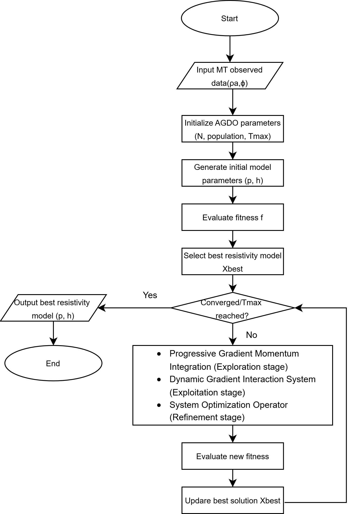
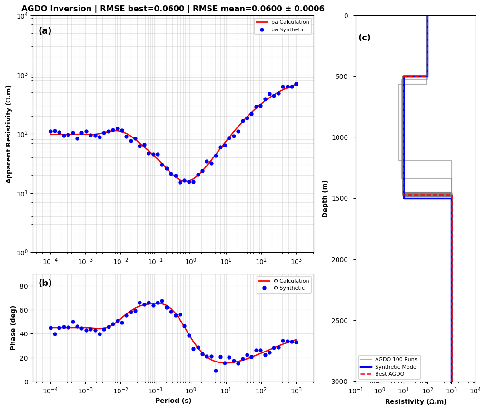
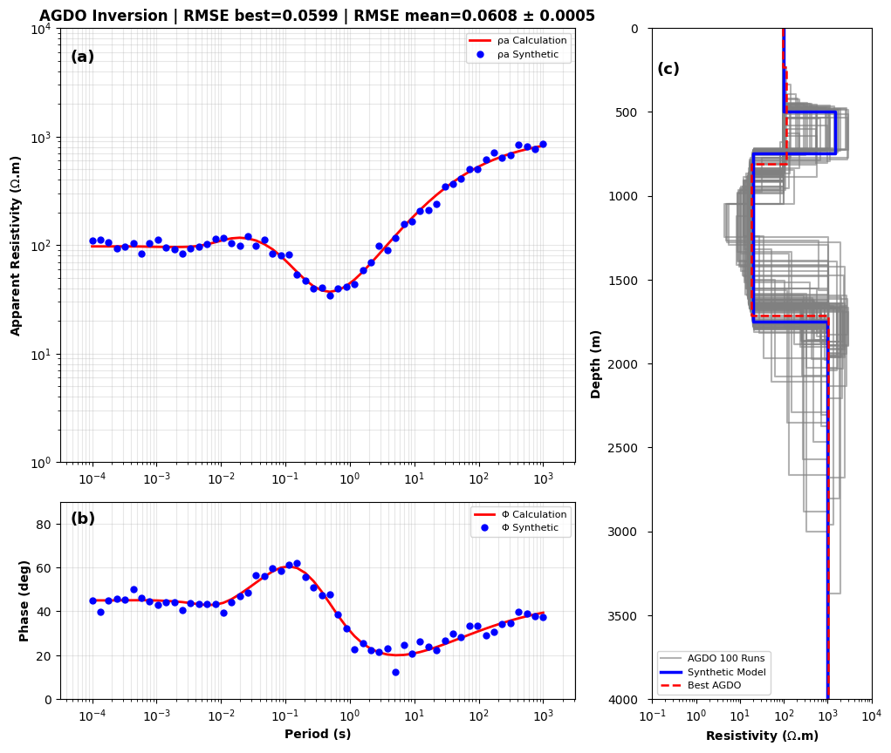
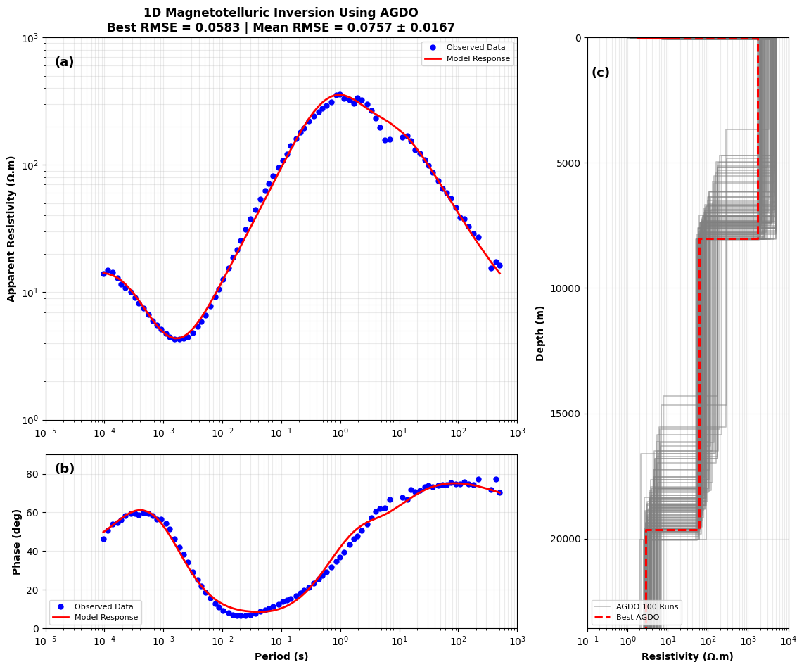

# AGDO-MT

<p align="center">

[](https://doi.org/10.5281/zenodo.21479038)


</p>

<p align="center">

<b>A Python package for One-Dimensional Magnetotelluric (MT) Forward Modelling and Inversion using the Adam Gradient Descent Optimizer (AGDO).</b>

</p>

<p align="center">

Scientific Python Package • Forward Modelling • AGDO Optimization • SEG-EDI Reader • Visualization

</p>

---

<p align="center">



</p>

AGDO-MT is an open-source Python package designed for one-dimensional (1D) magnetotelluric (MT) forward modelling and inversion. The package provides a complete workflow, including MT forward modelling, synthetic data generation, SEG-EDI file processing, visualization, and inversion using the Adam Gradient Descent Optimizer (AGDO).

Originally developed as part of undergraduate research at Institut Teknologi Sumatera (ITERA), AGDO-MT has subsequently been described in a peer-reviewed journal publication. The package aims to provide a reproducible, extensible, and research-oriented framework for one-dimensional magnetotelluric inversion studies.

# Features

### Forward Modelling

- One-dimensional layered-earth MT forward modelling
- Apparent resistivity computation
- Phase computation

### Inversion

- Adam Gradient Descent Optimizer (AGDO)
- Early stopping criterion
- Adaptive learning rate
- Population-based exploration
- Levy Flight strategy

### Data Processing

- SEG-EDI file reader
- MT response extraction
- Synthetic MT model generation
- Gaussian noise simulation

### Visualization

- MT response plots
- Layered resistivity models
- Convergence curves
- Ensemble inversion analysis

### Software Engineering

- Modular Python package
- Unit-tested implementation (36 tests)
- Validation notebooks
- Type hints and NumPy-style documentation

# Installation

Clone the repository

```bash
git clone https://github.com/alyasirharahap/AGDO-MT-Inversion.git
cd AGDO-MT-Inversion
```

Create a virtual environment (optional but recommended)

```bash
python -m venv .venv
```

Activate the environment

Windows

```bash
.venv\Scripts\activate
```

Linux / macOS

```bash
source .venv/bin/activate
```

Install the package

```bash
pip install -e .
```

# Quick Start

## Read an EDI file

```python
from yasir_agdo_mt.io import read_edi

edi = read_edi("data/edi/L09S10_edt.edi")
```

## Perform forward modelling

```python
from yasir_agdo_mt.core import mt1d

Z, rho, phase = mt1d(
    frequency,
    resistivity,
    thickness
)

```
## Optimizer Configuration

The optimizer behavior can be customized using `AGDOConfig`.

```python
from yasir_agdo_mt import AGDOConfig

config = AGDOConfig(
    npop=200,
    niter=300,
    learning_rate=0.05,
    tolerance=1e-3,
    patience=25,
)

result = invert_mt1d(
    frequency,
    rho_obs,
    phase_obs,
    lb,
    ub,
    config=config,
)
```

## Run inversion

```python
from yasir_agdo_mt.core import invert_mt1d

result = invert_mt1d(...)
```

## Visualize

```python
from yasir_agdo_mt.visualization import (
    plot_model,
    plot_mt_response,
    plot_convergence,
)

plot_model(result)
```
# Validation

The package has been validated using:

- Analytical forward modelling
- Synthetic layered-earth models
- Field MT datasets
- Benchmark optimization functions
- Automated unit testing

| Component | Status |
|----------|:------:|
| Forward Modelling | ✅ |
| AGDO Optimizer | ✅ |
| SEG-EDI Reader | ✅ |
| Visualization | ✅ |
| Synthetic Data | ✅ |
| Unit Tests | ✅ (36 Passed) |

---

# Scientific Background

Magnetotelluric (MT) inversion is a nonlinear and non-unique optimization problem aimed at estimating subsurface electrical resistivity models from observed apparent resistivity and phase responses. Conventional optimization methods often depend on the initial model and may become trapped in local minima.

AGDO-MT addresses these challenges by implementing the Adam Gradient Descent Optimizer (AGDO), which combines adaptive gradient optimization with population-based exploration to achieve stable convergence while maintaining computational efficiency.

The package has been validated using benchmark functions, synthetic MT models, and real field datasets, providing a reproducible framework for magnetotelluric inversion research.

# Experimental Setup

The performance of the proposed AGDO algorithm was evaluated through three consecutive experiments designed to assess its optimization capability, inversion accuracy, and applicability to real magnetotelluric (MT) data.

| Stage | Objective |
|--------|-----------|
| Benchmark Function | Evaluate the global optimization capability of AGDO |
| Synthetic MT Inversion | Assess inversion accuracy using controlled layered-earth resistivity models |
| Field MT Inversion | Validate the proposed algorithm using real MT observations |

# Synthetic Dataset

Synthetic MT responses were generated from one-dimensional layered-earth resistivity models using forward modelling. To simulate realistic measurement conditions, Gaussian noise with a standard deviation of 5% was added to the calculated apparent resistivity and phase responses.

| Parameter | Value |
|-----------|------:|
| Earth Model | Layered Earth |
| Frequency Range | 10⁻³ – 10⁴ Hz |
| Number of Frequencies | 56 |
| Noise Level | 5% Gaussian Noise |
| Independent Runs | 100 |

# Field Dataset

Field validation was performed using publicly available magnetotelluric (MT) data acquired from the Cloncurry region, Queensland, Australia. The dataset is provided in SEG-EDI format and contains frequency, impedance tensor, apparent resistivity, and phase information.

An example dataset included in this repository is:

```text
data/edi/L09S10_edt.edi
```

The EDI files serve as the input for the one-dimensional inversion workflow implemented in AGDO-MT.

# AGDO Parameters

Two optimization configurations were used throughout the experiments.

| Parameter | Synthetic | Field |
|-----------|----------:|------:|
| Population Size | 120 | 200 |
| Maximum Iterations | 150 | 300 |
| Learning Rate | 0.05 | Adaptive |
| β₁ | 0.9 | 0.9 |
| β₂ | 0.999 | 0.999 |
| Early Stopping | Enabled | Enabled |

The parameter settings were selected empirically to provide stable convergence while maintaining computational efficiency for both synthetic and field inversion experiments.

# Results

The proposed AGDO algorithm was evaluated using benchmark optimization problems, synthetic MT inversion experiments, and field MT datasets. Overall, the results demonstrate stable convergence, accurate reconstruction of layered-earth resistivity models, and consistent performance across repeated optimization runs.

## Benchmark Function

The Peaks benchmark function was used to verify the global optimization capability of AGDO before applying the algorithm to MT inversion.

<p align="center">

</p>

The optimization process demonstrates AGDO's ability to efficiently explore the search space during the early iterations and gradually converge toward the global optimum.

## Synthetic MT Inversion

Four synthetic layered-earth resistivity models with different geological configurations were used to evaluate the inversion performance of AGDO.

### Model 1

<p align="center">

</p>

### Model 2

<p align="center">

</p>

### Model 3

<p align="center">

</p>

### Model 4

<p align="center">

</p>

Across all four synthetic models, AGDO successfully reconstructed the original layered-earth resistivity structures with low RMSE values and stable convergence behavior.

## Convergence Analysis

<p align="center">

</p>

The convergence curves show a rapid decrease in RMSE during the initial iterations, followed by gradual convergence toward stable solutions. This behavior indicates that AGDO effectively balances global exploration and local exploitation throughout the optimization process.

## Field MT Inversion

The proposed algorithm was further validated using three MT stations from the Cloncurry region, Queensland, Australia.

### Station L02S18

<p align="center">

</p>

### Station L19S12

<p align="center">

</p>

### Station L19S10

<p align="center">

</p>

The calculated apparent resistivity and phase responses show good agreement with the observed data, demonstrating that AGDO can successfully recover realistic subsurface resistivity models from field MT measurements.

# Computational Performance

The performance of AGDO-MT was evaluated on the following hardware configuration.

| Component | Specification |
|-----------|---------------|
| Processor | AMD Ryzen 5 7535HS |
| Memory | 16 GB RAM |
| GPU | NVIDIA GeForce RTX 3050 Laptop GPU |
| Operating System | Windows 11 |
| Python Version | Python 3.10 |

The average execution time for a single inversion run is approximately **20 seconds** under the experimental settings used in this study. Actual execution time may vary depending on the optimization parameters, model complexity, hardware specifications, and Python environment.

# Main Findings

The experimental results demonstrate that:

- AGDO successfully reconstructs one-dimensional layered-earth resistivity models from both synthetic and field MT data.
- The optimizer achieves stable convergence while maintaining a balance between global exploration and local exploitation.
- Synthetic inversion experiments produce low RMSE values and accurately recover the original resistivity structures.
- Field inversion results show good agreement between observed and calculated apparent resistivity and phase responses.
- The modular implementation facilitates reproducible research and future algorithm development.

# Limitations

The current implementation focuses on one-dimensional magnetotelluric (MT) inversion under the assumption of horizontally layered earth models. The package does not currently support:

- Two-dimensional (2D) MT inversion
- Three-dimensional (3D) MT inversion
- Joint geophysical inversion
- Parallel or distributed optimization

# Future Work

Potential future developments of AGDO-MT include:

- Extension to two-dimensional (2D) MT inversion
- Extension to three-dimensional (3D) MT inversion
- GPU acceleration for faster optimization
- Parallel optimization strategies
- Comparative studies with other optimization algorithms (e.g., PSO, GWO, and OOBO)
- Adaptive population strategies
- Multi-objective optimization
- Joint geophysical inversion

# Repository Gallery

The following figures summarize the major stages and results of the AGDO-MT inversion workflow.

---

## Benchmark Optimization

<p align="center">

</p>

The Peaks benchmark function was used to evaluate the global optimization capability of AGDO prior to MT inversion.

---

## Synthetic MT Inversion

<p align="center">

</p>

<p align="center">

</p>

<p align="center">

</p>

<p align="center">

</p>

Four synthetic layered-earth models were used to evaluate inversion accuracy under different resistivity configurations.

---

## Convergence Analysis

<p align="center">

</p>

The convergence history illustrates the optimization behavior of AGDO throughout the inversion process.

---

## Field MT Inversion

### Station L02S18

<p align="center">

</p>

### Station L19S12

<p align="center">

</p>

### Station L19S10

<p align="center">

</p>

The field inversion results demonstrate good agreement between observed and calculated MT responses, indicating the applicability of AGDO to real MT datasets.

# Citation

If you use AGDO-MT in your research, please cite the associated publication.

```bibtex
@article{harahap2026agdo,
  author  = {Muhammad Fadhilah Al Yasir Harahap and Ledi Defita Yeni},
  title   = {Application of the Adam Gradient Descent Optimizer (AGDO) for One-Dimensional Magnetotelluric (MT) Data Inversion},
  journal = {Phi: Jurnal Pendidikan Fisika dan Terapan},
  volume  = {12},
  number  = {2},
  pages   = {316--331},
  year    = {2026},
  doi     = {},
  url     = {https://jurnal.ar-raniry.ac.id/index.php/jurnalphi/article/view/34593}
}
}
```

**Publication**

https://jurnal.ar-raniry.ac.id/index.php/jurnalphi/article/view/34593

# License

This project is released under the MIT License. See the `LICENSE` file for more information.

# Author

**Muhammad Fadhilah Al Yasir Harahap**

Department of Geophysical Engineering

Faculty of Industrial Technology

Institut Teknologi Sumatera (ITERA)

Indonesia

# Acknowledgements

The author gratefully acknowledges:

- Institut Teknologi Sumatera (ITERA)
- Department of Geophysical Engineering
- Geoscience Australia for providing the public MT dataset
- Researchers whose previous work contributed to the development of this study

# Contact

For questions, suggestions, or collaboration:

**Email:** alyasirharahap@gmail.com

---

<p align="center">

⭐ If you find AGDO-MT useful for your research, please consider giving this repository a star.

</p>